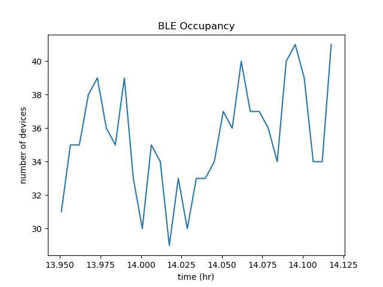

HW Miniproject by Ryan Rosenberger and Daniel Cabrera 

We set up our Raspberry Pi in the Senior Design lab adjacent to the windows, in hopes of being in proximity to cars passing on I-90. Running the wifi_scan.py script for 250 loops (roughly 15 minutes), we obtained a json file that was plotted using wifi_plot.py. This resulted in the above plot. The script removed wifi hotspots that were constant, so the plot shows new wifi hotspots that were passing by.

From the plot, a considerable amount of variation can be seen over time, suggesting movement of wifi hotspots. This could be attributed to passing cars, or to other passing mobile hotspots of people moving around in the Photonics Center.

As for difficulties with the Raspberry Pi, there were some missing packages that had to be installed using pip before the scripts could be run. Otherwise, the execution of this task was straightforward.

In addition to this task, we also created some scripts to collect and plot bluetooth data over time. Our script titled ble_scan_2.py collects the number of bluetooth devices in range for a specified runtime, measurement time, and time between measurements. Then, ble_plot.py plots that data for analysis.

